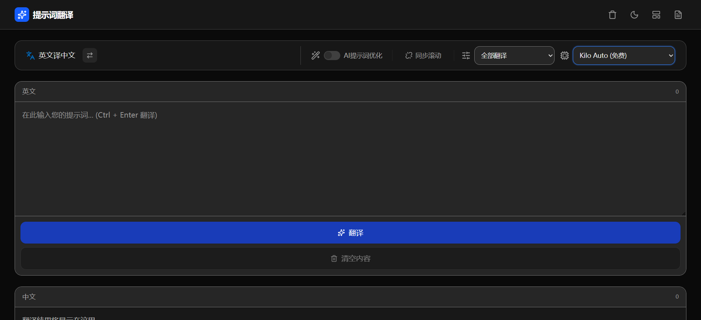

  

# 预览

# 提示词翻译 (Prompt Translator)

一款专为 AI 提示词设计的智能翻译工具，支持多模型接入、JSON/代码结构保护、离线翻译及数据库管理功能。

## ✨ 核心特性

- **多模型支持**：集成 Google Gemini、火山方舟 (DeepSeek)、阿里百炼 (Qwen)、NVIDIA、Kilo Code 以及本地离线模型。
- **结构化翻译**：独有的“仅翻译值”模式，完美保留 JSON、YAML、XML 或代码中的键名与结构，只翻译内容。
- **提示词优化**：内置专家级 Prompt 优化引擎，翻译的同时自动润色提示词，提升 AI 响应质量。
- **离线翻译**：基于 Transformers.js 的本地模型，无需联网即可进行基础翻译，保障数据隐私。
- **数据管理**：内置 D1 数据库模拟（支持云端部署），支持保存翻译历史、管理员权限验证及记录检索。
- **深色模式**：精心设计的深色/浅色主题切换，保护视力。

# 🚀 部署教程

## Cloudflare Pages

1. **Fork 该项目**
2. **在 Cloudflare Pages 创建项目**
   - 访问 [Cloudflare Pages](https://pages.cloudflare.com/)
   - 连接 GitHub 仓库
   - 框架选择：React(Vite)
3. **添加环境变量**
   - 按下方「环境变量」表配置
4. **保存并部署**
   - 创建D1数据库在控制台[初始化建表语句](https://github.com/zxlwq/translate/blob/main/schema.sql)，并绑定D1数据库（变量名称必须为 `DB`）
   - 绑定自定义域名（可选）

# 配置环境变量

| 变量名 | 说明 | 示例 | 是否必须 |
|--------|------|------|------|
| PASSWORD | 管理员密码 | 123456 | ✅ |
| GEMINI_API_KEY | Gemini API Key | AIzaSyxxxxxvv | 可选 |
| ARK_API_KEY | 火山方舟 API Key | sk-xxx | 可选 |
| QWEN_API_KEY | Qwen API Key | sk-xxx | 可选 |
| NVIDIA_API_KEY | NVIDIA API Key | nvapi-xxx | 可选 |
| KILO_API_KEY | Kilo Code API Key| eyxxxx | 可选 |

# 📖 使用教程

## 1. 基础翻译
1. 在左侧输入框输入提示词（支持中文或英文）。
2. 选择翻译方向（中译英 / 英译中）。
3. 点击“翻译”按钮或按下 `Ctrl + Enter`。

## 2. 高级模式
- **翻译模式**：
  - `全部翻译`：翻译整个文本内容。
  - `仅翻译值 (保留键名)`：**推荐用于 JSON/代码**。系统会自动识别并跳过键名、标签和结构符号。
- **优化开关**：开启“提示词优化”后，AI 会作为专家对提示词进行润色和结构重组，使其更符合 AI 理解习惯。

## 3. 模型选择
在底部控制面板选择不同的 AI 提供商：
- **离线翻译**：无需联网，适合敏感数据，但精度略低。
- **Gemini / DeepSeek / Qwen**：推荐用于复杂、长文本或高质量要求的翻译。

## 4. 数据库管理 (管理员)
1. 点击顶部导航栏的"数据库"图标。
2. 输入管理员密码。
3. 查看、复制或删除已保存的翻译记录。